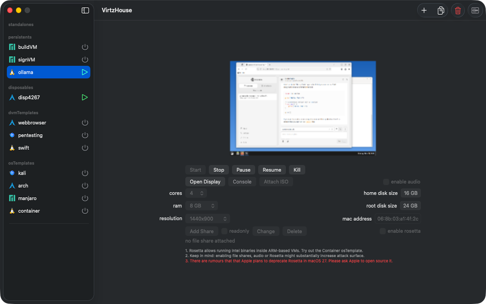

### Run macOS and Linux Virtual Machines at Near-Native Speed

Experience a new standard for desktop virtualization.

### This is for the tech-savvy, the security experts, the Linux enthusiasts, the Apple Silicon lovers... for those who want quality, aesthetics, and speed.

VirtzHouse provides a high-performance management layer for Apple's Virtualization Framework, allowing you to run macOS® and Linux®-based operating systems in secure, isolated environments.

- Spin up clean Linux environments to develop and test code, compilers, and dependencies without cluttering your productive systems.
- Open suspicious files or browse the web in "throwaway" virtual machines for maximum isolation.
- Run beta versions of macOS in a VM to evaluate new APIs and test software compatibility safely.
- Get started instantly with community-based osTemplates preconfigured for VirtzHouse's security model. 
- Leverage native Apple silicon technology, enjoy near-native CPU performance and ultra-fast disk I/O compared to traditional emulation.

Use "OsTemplate" VMs as a basis for your Virtual Machines to inherit a stateless root filesystem. Use "DvmTemplate" VMs to customize your home directory, "Persistent" VMs to store your valuable data, "Disposable" VMs as throw-away systems and "Standalone" VMs for macOS.

### [Support](https://virtzhouse.github.io/support)

or visit directly [d/support](https://github.com/virtzhouse/virtzhouse.github.io/discussions/categories/support)

### [Privacy Policy](https://virtzhouse.github.io/privacy)

or visit directly [d/privacy](https://github.com/virtzhouse/virtzhouse.github.io/discussions/categories/privacy)
